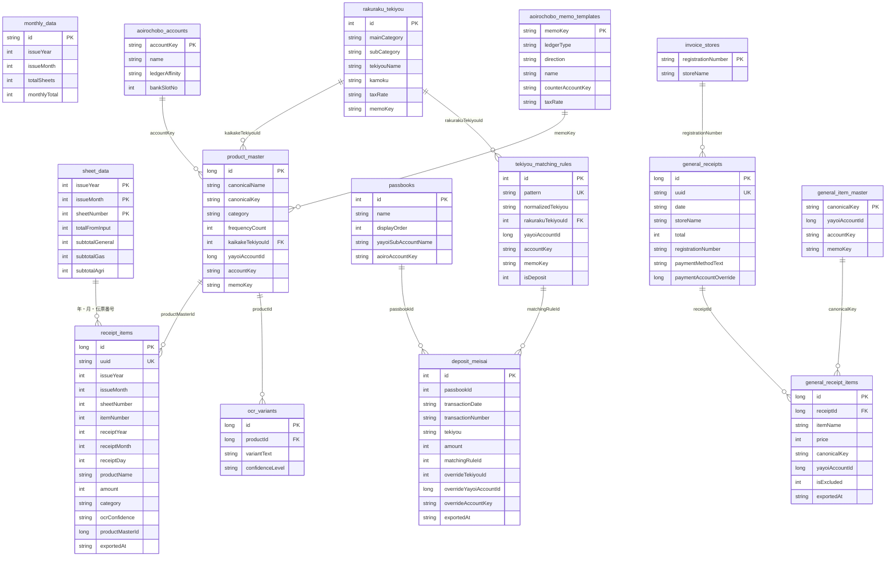

# 機能設計書

## 1. 画面構成・画面遷移

```mermaid
flowchart TD
    Menu["メニュー\n(MenuScreen)"]

    PurchaseMenu["JA購買伝票\n(PurchaseMenuScreen)"]
    ReceiptInput["伝票データ（撮影・OCR・編集）\n(ReceiptInputScreen)"]
    YearSummary["購買データ確認\n(YearSummaryScreen)"]
    MonthlySummary["月次サマリー\n(MonthlySummaryScreen)"]
    ProductList["購買品目別リスト\n(ProductListScreen)"]
    PurchaseOutputConfirm["出力確認（購買）\n(OutputConfirmScreen)"]

    DepositMenu["JA預金\n(DepositMenuScreen)"]
    PassbookData["通帳データ\n(PassbookDataScreen)"]
    TekiyouMatching["通帳摘要別リスト\n(TekiyouMatchingScreen)"]
    DepositOutputConfirm["出力確認（預金）\n(OutputConfirmScreen)"]

    GeneralMenu["レシート・領収書\n(GeneralPurchaseMenuScreen)"]
    GeneralCapture["撮影・OCR\n(GeneralReceiptCaptureScreen)"]
    GeneralConfirm["読み取り結果の確認\n(GeneralReceiptConfirmScreen)"]
    GeneralList["レシート領収書一覧\n(GeneralReceiptListScreen)"]
    GeneralItemMatching["商品名・但し書きリスト\n(GeneralItemMatchingScreen)"]
    GeneralOutput["出力確認（レシート）\n(GeneralReceiptOutputScreen)"]
    InvoiceStoreList["登録番号・店舗・発行者一覧\n(InvoiceStoreListScreen)"]
    PaymentRules["支払方法の科目設定\n(ReceiptPaymentMethodRuleScreen)"]

    BookkeepingMenu["簿記ソフト連携\n(BookkeepingMenuScreen)"]
    YayoiAccounts["弥生：勘定科目\n(YayoiAccountSettingsScreen)"]
    YayoiAccountEdit["科目の編集\n(YayoiAccountEditScreen)"]
    AoiroVocab["あおいろ帳簿：勘定科目・摘要辞書\n(AoiroChoboVocabularyScreen)"]
    RakurakuAccounts["らくらく：勘定科目\n(RakurakuAccountSettingsScreen)"]
    RakurakuTekiyou["らくらく：摘要辞書\n(RakurakuTekiyouScreen)"]

    Settings["設定\n(SettingsScreen)"]

    Menu --> PurchaseMenu
    Menu --> DepositMenu
    Menu --> GeneralMenu
    Menu --> BookkeepingMenu
    Menu --> Settings

    PurchaseMenu --> ReceiptInput
    PurchaseMenu --> YearSummary
    PurchaseMenu --> ProductList
    PurchaseMenu --> PurchaseOutputConfirm
    ReceiptInput --> MonthlySummary
    YearSummary --> MonthlySummary

    DepositMenu --> PassbookData
    DepositMenu --> TekiyouMatching
    DepositMenu --> DepositOutputConfirm

    GeneralMenu --> GeneralCapture
    GeneralCapture --> GeneralConfirm
    GeneralMenu --> GeneralList
    GeneralMenu --> GeneralItemMatching
    GeneralMenu --> GeneralOutput
    GeneralMenu --> InvoiceStoreList
    GeneralMenu --> PaymentRules

    BookkeepingMenu --> YayoiAccounts
    YayoiAccounts --> YayoiAccountEdit
    BookkeepingMenu --> AoiroVocab
    BookkeepingMenu --> RakurakuAccounts
    BookkeepingMenu --> RakurakuTekiyou
```

- `ReceiptInputScreen` は JA 伝票の撮影（埋め込みの `CameraScreenForOcr`）・OCR・編集・保存までを 1 画面で行う
- `CameraScreen` / `CameraScreenForOcr` / `TransformPreviewScreen` は他の画面に埋め込むコンポーザブルなので NavHost にルートが無い（不具合ではない）
- 通帳の管理（追加・名前・弥生の補助科目・あおいろの口座・削除）は通帳データ画面の ⋮ メニューから開くダイアログ（`PassbookManageDialog`）
- 買掛摘要辞書・預金摘要辞書の専用画面は、どこからも開けなかったので 2026-09-26 に削除した。摘要は「らくらく：摘要辞書」の各タブで扱う

### 一覧画面の共通 UI

| 要素 | 仕様 |
|---|---|
| 文字サイズ | タイトルバー右上の A- / A+（`FontSizeControl`）。10〜20sp、全一覧で共通の `listFontSize` |
| 年の絞り込み | 年の選択と「作業年で固定」（`lockYearToWorking`） |
| 検索・並び替え・絞り込み | 折りたたみパネル（`ListFilterComponents.kt`） |
| メニュー画面 | `MenuColumn`。収まれば中央寄せ、収まらなければ（横向きなど）スクロール |

---

## 2. データモデル（ER 図）

主要な列だけを載せる。全列は各エンティティ（`data/*.kt`）、テーブルの一覧は `docs/architecture.md` を見ること。

- 図の線のうち Room の外部キーを張っているのは `product_master.kaikakeTekiyouId`・`tekiyou_matching_rules.rakurakuTekiyouId`（どちらも SET_NULL）・
  `ocr_variants.productId`・`general_receipt_items.receiptId` だけ。ほかは列の値で引き当てているだけで、制約は無い
- 会計ソフトごとの紐付けは別々の列に持つ（弥生 `yayoiAccountId`／あおいろ `accountKey`・`memoKey`／らくらく `*TekiyouId`）。
  弥生とあおいろは科目体系が別物なので、互いに変換しない
- `accountKey` / `memoKey` は PC 会計アプリ（AoiroChobo）が持つ不透明な文字列。名前（`*KeyName`）は確定したときに見えていた名前を控えたもので、
  PC 側で名前が変わったら紐付けを外す合図に使う
- 通帳は最大 5 冊（DB v39〜）。明細の重複判定は UNIQUE(passbookId, transactionDate, transactionNumber)。
  CSV に口座番号が無いので、取り込むときに取込先の通帳を選ぶ。摘要マッチングのルールは通帳をまたいで共通
- `ocr_variants` は ML Kit 時代の学習テーブル。学習の書き込み経路は 2026-08-11 に削除済みで、
  出力時に商品名から商品マスタを引く最後の手段（`getByText()`）としてだけ読んでいる

---

## 3. OCR パイプライン

JA 伝票は `GreenFrameDetector` → `GeminiReceiptClient` → `JaSheetOcrMapper`、レシートは撮影画像をそのまま
`GeminiReceiptClient.parseReceiptFromImage()` に送る。フロー図と各コンポーネントの役割は `docs/architecture.md` の
「システムフロー」を参照（重複を避けるためここには再掲しない）。

---

## 4. カテゴリ判定仕様（JA 購買）

**`ReceiptItem.category` の 4 種類**（`util/Category.kt`）:

| カテゴリ | 意味 | 判定する文字列の例（OCR の誤読みも含む） |
|---|---|---|
| 未分類 | 既定・未判定 | — |
| 一般購買 | 通常の購買品 | 一般購買・一般講買・一般課買・般購買 |
| 給油所 | 燃料・ガソリン | 給油所・給造所・給治所 |
| 農業機械 | 農業用機械・部品 | 農業機械・農来 |

- OCR 直後に `JaSheetOcrMapper` が小計行の区分名から仮に判定し、保存後に `CategoryRecalculator` が月全体の全伝票・全行を判定し直して確定する
- 各行は直後の小計行のカテゴリを引き継ぐ。小計行の文字列が崩れていても、区分ごとの固有の文字 1 字で判定するフォールバックがある

---

## 5. 出力仕様

出力先は設定の「連携会計ソフト」で決まる。列ごとの詳しい仕様は `docs/PC_ACCOUNTING_INTEGRATION_SPEC.md` の §7。

| 部門 | 弥生の青色申告 | あおいろ帳簿 | らくらく青色申告 |
|---|---|---|---|
| JA 購買 | 仕訳 CSV | `transactions.json` | シンプル CSV |
| JA 預金 | 仕訳 CSV | 未対応（らくらく CSV が出る） | シンプル CSV |
| レシート | 仕訳 CSV | 未対応（らくらく CSV が出る） | シンプル CSV |

どの出力も、書き出した行に出力日時（`exportedAt`）を記録し、出力確認画面で「未出力のみ表示」に絞り込める。
弥生 CSV は、科目が決まっていない行が選ばれていると出力せず、科目を設定するかチェックを外すよう求める。

### 弥生 仕訳 CSV

- 25 列・windows-31j（`CsvUtils.yayoiCharset()`。Shift_JIS だと ①・㈱ などが ? に化けるため）・CRLF・全項目を引用符で囲む・ヘッダ行なし
- 日付は和暦（`R.07/05/01`）
- **列の並びが部門で違う**（既知の不整合・`docs/known-issues.md`）：レシートは先頭が識別フラグ `2000` の正式な並び、購買・預金は `2000` が無く独自の並び
- 購買：借方＝商品の科目（子科目なら親科目＋補助科目）、貸方＝買掛金
- 預金：入金は 借方＝普通預金・貸方＝摘要の科目、出金は その逆。普通預金の補助科目に通帳の `yayoiSubAccountName` を入れる
- レシート：借方＝品目の科目、貸方＝支払方法の科目（`receipt_payment_method_rules`）

### あおいろ帳簿 `transactions.json`（購買のみ）

- 契約は `docs/integration/transaction-import.md`（schemaVersion 2）。UTF-8・BOM なし
- 組み立ては `util/AoiroChoboTransactionsBuilder.kt`。借方＝商品の `accountKey`、貸方＝`ledgerAffinity == "AP"` の科目（買掛金）、
  摘要＝商品の `memoKey`。`externalId` は `ocr:purchase:{receipt_items.uuid}`
- 科目や摘要が決まっていない行も止めずに出す（PC 側が「要確認」として受ける）。出力後に 確定／摘要なし／科目なし の件数を表示する

### らくらく シンプル CSV（UTF-8・ヘッダあり）

| 部門 | ヘッダ | 中身 |
|---|---|---|
| 購買 | `ID,日付,摘要,メモ,金額` | 日付 `yyyy/MM/dd`・摘要＝商品の買掛摘要・メモ＝商品名 |
| 預金 | `ID,日付,摘要,メモ,金額` | 日付 `yyyy-MM-dd`・摘要＝ルールか個別上書きの摘要・メモ＝通帳の摘要原文・金額は入金が正、出金が負 |
| レシート | `日付,商品名,金額,勘定科目,科目コード` | 日付 `yyyy/MM/dd` |

購買は、どの形式でも商品名に「小計」「合計」を含む行を出さない。預金の「金額を隠す」設定は画面の表示だけで、CSV には効かない。

---

## 6. 摘要マッチング仕様（JA 預金）

1. 通帳データ画面で CSV を取り込む（取込先の通帳を選ぶ。取引通番が空の行には `DepositNumberAssigner` が通帳ごとに合成番号を振る）
2. 通帳摘要別リストを開くと `updateRulesFromMeisai()` が明細の摘要を正規化してルール（`tekiyou_matching_rules`）を作り、
   明細の `matchingRuleId` を書き戻す
3. グループ（ルール）単位で科目を決める。会計ソフトごとに別の列に入る（らくらく `rakurakuTekiyouId`・弥生 `yayoiAccountId`）
4. 一部の明細だけ別の科目にしたいときは明細側で上書きする（`overrideTekiyouId`・`overrideYayoiAccountId`）
5. グループの科目を保存し直すと、そのルールの明細の上書きはリセットされる（`clearOverridesForRule()` / `clearYayoiOverridesForRule()`）
6. 未マッチの摘要はまとめて Gemini に科目を提案させられる（「AIで一括提案」）

ルールと明細の `accountKey`・`memoKey` 列（あおいろ用）はあるが、預金の `transactions.json` は未着手。

---

## 7. 商品名入力の文字幅変換仕様（ReceiptInputScreen）

伝票データ画面のセル編集ダイアログ（`CellEditDialog`）の商品名フィールド。変換は `util/ProductNameInputUtils.kt`。

- 新しく入力した部分だけを変換する（前後の一致部分を除いた差分を見る `applyConversionToNewInput`）。既にある文字は変えない
- 数字（0-9）と半角スペースは常に全角にする
- 英字はトグル（英字：全角 / 半角、既定は全角）の選択に従う
- 「一括全角」ボタンで、今の文字列の半角英数字・記号・スペースをまとめて全角にする（`convertAllToFullWidth`）
