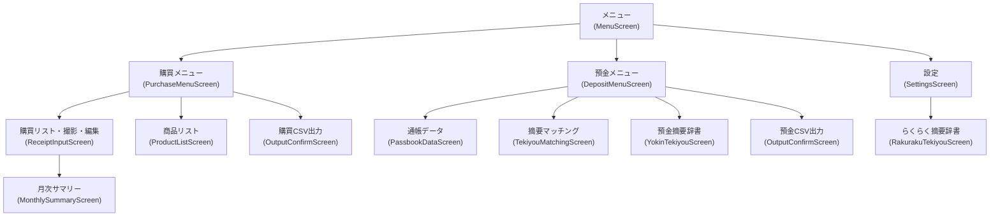
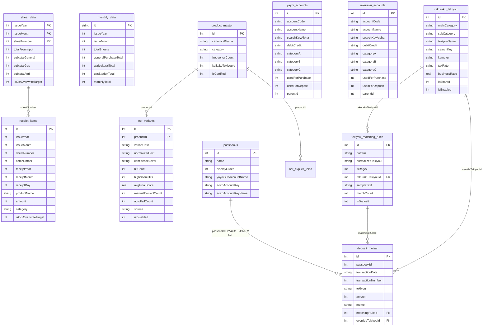

# 機能設計書

## 1. 画面構成・画面遷移



`ReceiptInputScreen`は撮影（独自`CameraView`）・編集・保存・CSV連携用データ確定までを
単体で完結する（`OcrCaptureScreen`/`SheetEditorScreen`はPhase6で削除。旧図に残っていた
これらのノード・エッジは本番UIから到達不能なまま存在した死んだ経路だった）。

> **注意**: `AccountSettingsScreen`（勘定科目設定）は実装済みだが Navigation 未接続。

---

## 2. データモデル（ER図）



通帳（預金口座）は最大 5 冊（DB v39〜）。明細の重複判定は UNIQUE(passbookId, transactionDate, transactionNumber)。
CSV に口座番号が無いので、取り込むときに取込先の通帳を選ぶ。摘要マッチングのルールは通帳をまたいで共通。
弥生 CSV は預金側の「普通預金」の補助科目に通帳の `yayoiSubAccountName` を入れる。

（`ocr_explicit_joins`・`correction_logs`・`ocr_score_logs`はPhase6（v27→v28、`MIGRATION_27_28`）で
DROP済みのためこの図から削除。上記以外にも`general_item_master`・`receipt_payment_method_rules`等の
2026-08以降追加テーブルがある。全テーブルの最新一覧は`docs/architecture.md`参照）

---

## 3. OCR パイプライン

購買伝票OCRはGemini Vision API方式（`GreenFrameDetector` → `GeminiReceiptClient` →
`JaSheetOcrMapper`）。`OCRProcessor`（ML Kit）・`ProductNameCorrectorV3`・
`cleanLeadingRuleNoise()`はPhase6（2026-08-11）で削除済み。詳細なフロー図・各コンポーネントの
役割は`docs/architecture.md`の「システムフロー（JA伝票、Gemini Vision API移行後）」節を
参照（重複管理を避けるためここには再掲しない）。

---

## 4. カテゴリ判定仕様

**ReceiptItem.category の4種類:**

| カテゴリ | 意味 | 判定文字列例 |
|---|---|---|
| 未分類 | デフォルト・未判定 | — |
| 一般購買 | 通常仕入商品 | "一般購買"・"一般課買" |
| 給油所 | 燃料・ガソリン | "給油所"・"給造所" |
| 農業機械 | 農業用機械・部品 | "農業機械"・"農来" |

- 各行は直後の小計行のカテゴリを引き継ぐ
- 一文字判定フォールバック（固有文字の存在で分類）あり

---

## 5. OCR 学習システム（V3・現在は非稼働）

> **注意**: 以下は`OcrVariant`エンティティ（`ocr_variants`テーブル）に実装されている昇格
> ロジックの設計であり、コード自体（`OcrVariant.kt`の`canPromoteToConfirmed()`等）は現存する。
> ただし、この学習を駆動していた書き込み経路（`OcrVariantDao.registerLearning()`の呼び出し元・
> `OcrLearningStatusScreen`）はPhase6（2026-08-11）で削除済みのため、現在このロジックは
> 実行されていない。現行のGeminiパイプラインでは`ocr_variants`はCSV出力時の商品名照合
> フォールバック（`ocrVariantDao.getByText()`、読み取り専用）としてのみ使われる。

### バリアント昇格条件（非稼働）

| 遷移 | 条件 |
|---|---|
| AUTO → CONFIRMED（自動） | hitCount≥3 且つ avgFinalScore≥0.90 且つ highScoreHits≥2 且つ autoFailCount=0 |
| AUTO → CONFIRMED（手動） | manualCorrectCount≥2 |
| CONFIRMED → LOCKED | hitCount≥10 且つ avgFinalScore≥0.92 且つ autoFailCount=0 |

### 降格・無効化
- autoFailCount が閾値を超えた場合、CONFIRMED → AUTO に降格
- isDisabled=1 で補正対象から除外（手動または自動）

### 分離テキスト結合（削除済み）
- `ExplicitJoinMatcher`・`ocr_explicit_joins`テーブルはPhase6（v27→v28、`MIGRATION_27_28`）で
  クラス・テーブルともに削除済み

---

## 6. CSV 出力仕様

### 購買 CSV（らくらく青色申告形式）

```
ID,日付,摘要,メモ,金額
1,2026/04/29,種苗費,フェニックス顆粒,15000
```

- 日付: `YYYY/MM/DD`
- 摘要: `RakurakuTekiyou.tekiyouName`（買掛摘要辞書から）
- メモ: `ReceiptItem.productName`
- 金額: `ReceiptItem.amount`（税込）

### 預金 CSV（らくらく青色申告形式）

```
ID,日付,摘要,メモ,入金,出金
1,2026-04-29,売掛金,JA振込,50000,
2,2026-04-30,諸会費,JA共済,,3000
```

- 日付: `YYYY-MM-DD`
- 摘要: `RakurakuTekiyou.tekiyouName`
- メモ: `DepositMeisai.tekiyou`（通帳摘要原文）
- 入金/出金: 金額の正負で分離
- `hideAmount` フラグで金額非表示可

---

## 7. 摘要マッチング仕様

1. `PassbookDataScreen` で通帳明細を入力
2. `TekiyouMatchingScreen` で `updateRulesFromMeisai()` を実行
   - 摘要テキストを正規化してマッチングルールを生成
   - 生成後に `deposit_meisai.matchingRuleId` を書き戻す（バグ修正済み 2026-04-05）
3. グループ展開 UI でルール単位に勘定科目を設定
4. 個別行に異なる科目が必要な場合は `overrideTekiyouId` で上書き
5. グループ編集保存時は `clearOverridesForRule()` で個別設定をリセット

---

## 8. 商品名入力の文字幅変換仕様（ReceiptInputScreen）

伝票編集ダイアログ（`ItemEditDialog`）の商品名フィールド：

- 数字（0-9）は入力時に常に全角へ自動変換
- 英字はトグル（全角Ａ / 半角A）で以降の入力に反映（既存テキストは変更しない）
- 「全て全角」ボタンで現テキストの半角英数字を一括全角変換
- 変換は新規入力部分のみに適用（差分検出方式）
